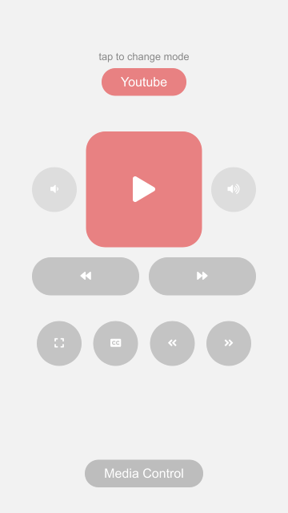
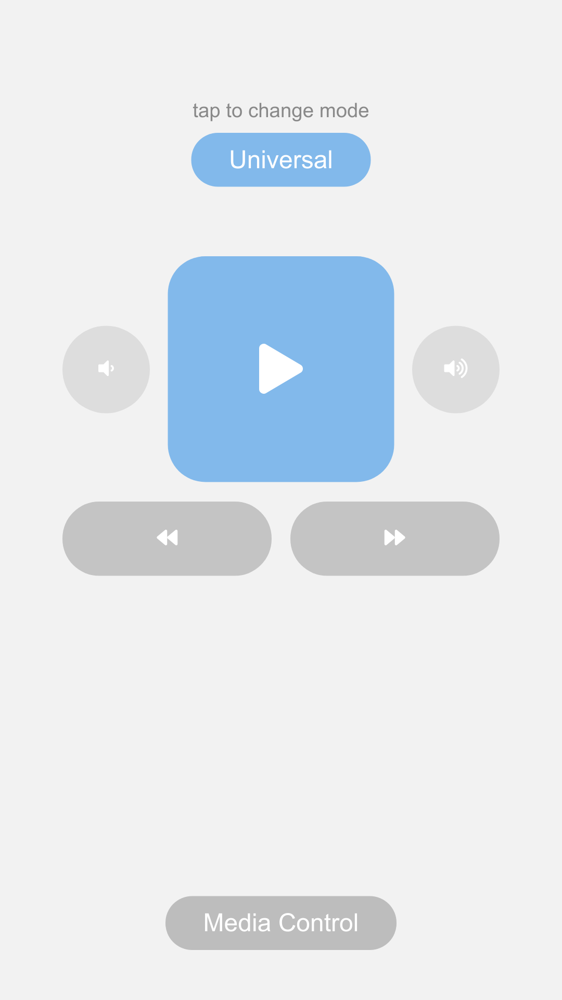

# Media Control

Control Youtube, streaming sites, media players on your computer using your phone as a remote.

### Installation
`pip install -r requirements.txt`

### Usage

Run `python media-control.py` and open `http://[host_address]:[port]` provided in the terminal on your phone.

## Features

#### Youtube mode

- Play/Pause
- Seek forward/backward in the video
- Enable/Disable captions
- Toggle fullscreen mode
- Go to next/previous video in a playlist
- Control Device volume

#### Universal mode

- Play/Pause and playing media
- Go to next/previous media in qeueu
- Control Device volume

## Server Details

Made using: Flask

flask is running on all addresses
in your current network.

Default host address = 0.0.0.0
Default port = 5000

- Check firewall if port 5000 is allowed or not.
- Change host to the local IP address of the device
you want to control.
- There is currently no security over this connection,
avoid using in a public network.

### Planned additions:

- Authentication
- SSL for security